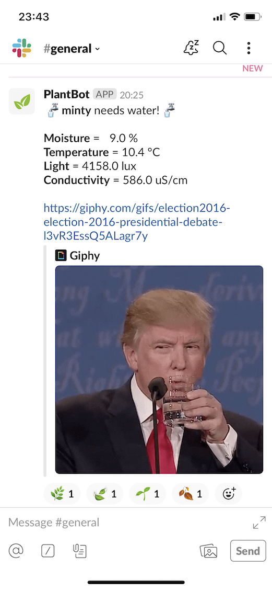

# PlantBot 

> Smart tracking for when to water plants with a pesky SlackBot!

- [Prerequisites](#prerequisites)
- [Installation](#installation)
- [Configuration](#configuration)
- [Deployment](#deployment)
- [Slack Output](#slack-output)

##
<a name="prerequisites"></a>
### Prerequisites

PlantBot requires _at minimum_ the following hardware setup:

- [Raspberry Pi Zero W](https://www.raspberrypi.org/products/raspberry-pi-zero-w/) for remote compute and storage needs
- [Xiaomi Mi Flora](https://xiaomi-mi.com/sockets-and-sensors/xiaomi-huahuacaocao-flower-care-smart-monitor/) sensor(s) to monitor temperature, soil moisture, conductivity and light conditions

<a name="installation"></a>
### Installation

Installation of PlantBot requires a working Raspberry Pi. [This guide](http://frederickvandenbosch.be/?p=2385) is suggested for setting up a Pi in headless mode.

PlantBot can be installed by cloning this repo and its python requirements.

```bash
$ git clone https://github.com/jfri3d/PlantBot.git
$ python3 setup.py install
```

Note that all processing is time-based (i.e. with `cron`), requiring the correct local time on the pi.

```bash
sudo cp /usr/share/zoneinfo/<continent>/<city> /etc/localtime
```

##
<a name="configuration"></a>
### Configuration

Minimal configuration with a `.envrc` file based on `.envrc.template` is required in order to link with Slack and determine correct sunrise/sunset times (i.e. based on location).

- build a [slackbot](https://api.slack.com/bot-users)
- define a [giphy](https://developers.giphy.com/) "app"
- identify the accurate [geolocation](https://www.latlong.net/) 

```text
export SLACK_TOKEN=
export SLACK_BOT_TOKEN=
export GIPHY_KEY=
export LAT=
export LON=
```

##

Finally, the most important aspect is to link the hardware with the software. In other words, determine the MAC address of each respective Mi Flora sensor. The basic linux tool `hcitool` identifies everything on the current network. The `Flower Care` sensor identifies the MAC address(es) that need to be saved.

```bash
$ sudo hcitool lescan

LE Scan ...

AA:AA:AA:AA:AA:AA Flower care
UU:UU:UU:UU:UU:UU (unknown)
XX:XX:XX:XX:XX:XX Flower care
```

The saved MAC address(es) need to be saved into the `./data/plant_def.json` file containing the following schema. Note that the default definition file naming can be changed in `./scripts/constants.py`.

```json
{
  "plants": [
    {
      "name": "minty",
      "mac_address": "XX:XX:XX:XX:XX:XX",
      "min_moisture": 30
    },
    {
      "name": "oregano",
      "mac_address": "AA:AA:AA:AA:AA:AA",
      "min_moisture": 20
    }
  ]
}

```

##
<a name="deployment"></a>
### Deployment

The two running processes for running PlantBot are as follows:

- `./scripts/plantbot.py` - responsible for daily scheduling of "reading" raw plant measurements
- `./scripts/slackbot_alert.py` - responsible for alerting via Slack which plant needs to be watered

These processes are deployed with supervisor, see [this guide](https://www.vultr.com/docs/installing-and-configuring-supervisor-on-ubuntu-16-04) for installation and setup.

- Access supervisor:
```bash
sudo supervisorctl
```

- Add both processes (defined in `./supervisor/`):
```bash
supervisor> add plantbot alert
```

- Check status of processes:
```bash
supervisor> status

plantbot      RUNNING   pid 1233, uptime 0:00:04
alert         RUNNING   pid 1234, uptime 0:00:04
```

##
<a name="slack-output"></a>
### Slack Output


